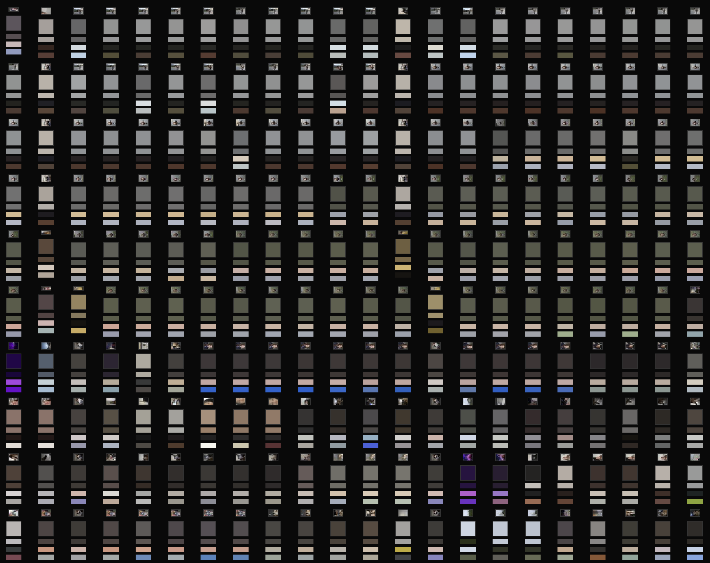
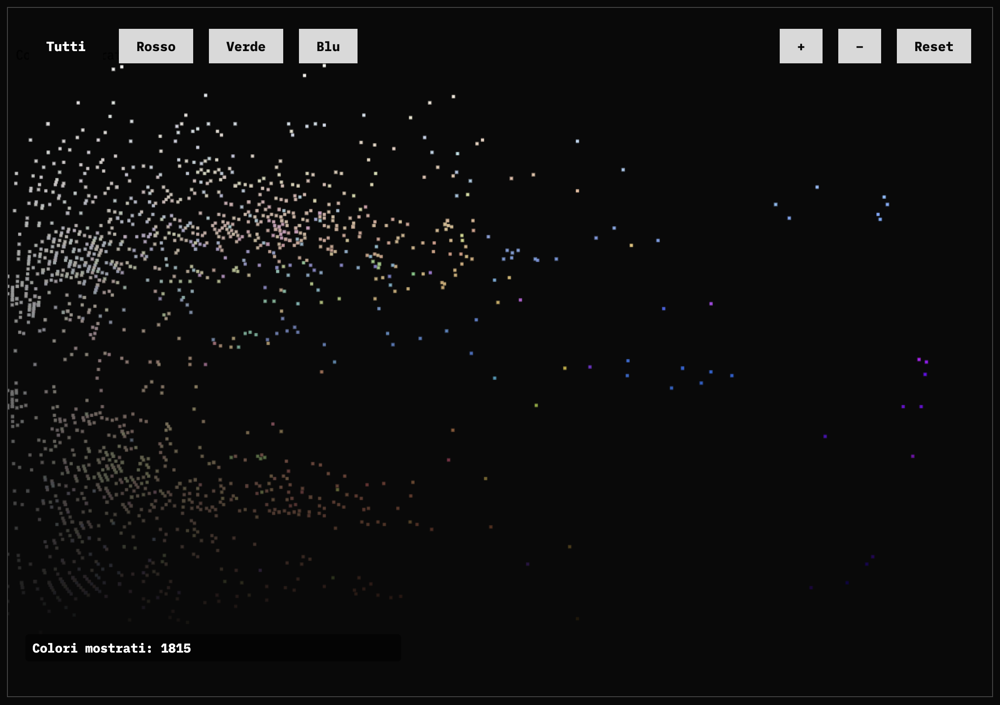
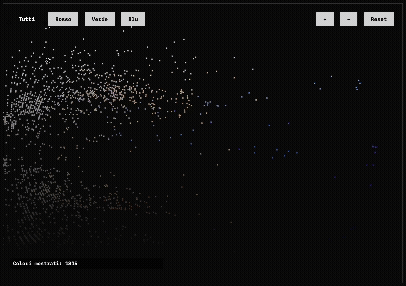

SUPSI 2025  
Corso d’Interaction Design, CV428.01  
Docenti: A. Gysin, G. Profeta  

Elaborato 1: Archivio fotografico

# I miei colori  
Autrice: Michelle Puttini  
🔗 [Link al sito](https://michelleputtini.github.io/Archivio-fotografico/)

## Introduzione e tema

Questo progetto nasce da un archivio fotografico personale composto da poco più di 600 immagini.  
L’idea è osservare il contenuto di questo archivio attraverso una lente semplice ma potente: il **colore**.

L’obiettivo non è classificare le immagini, ma lasciare che il **colore medio** (o i **tre colori medi**) raccontino cosa vediamo — e cosa non vediamo — in questa raccolta.  
L’utente viene guidato in un percorso che inizia con un mosaico basato sulla propria webcam e termina con un’analisi visiva dettagliata della palette complessiva.

## Struttura del sito

Il sito è diviso in quattro sezioni:

1. **Intro**  
   Breve contesto e spiegazione del progetto.

2. **Webcam**  
   La webcam dell’utente viene attivata e il volto viene ricostruito usando i colori dell’archivio:
   - Modalità *Mosaico*: le immagini originali dell’archivio vengono usate come tasselli.
   - Modalità *Colore Medio*: ogni cella è riempita con il colore medio dell’immagine più simile.
   - Modalità *3 Colori Medi*: ogni cella mostra i tre colori principali di un’immagine.

3. **Che succede?**  
   Spiegazione tecnica del funzionamento del sito e visualizzazione completa dell’archivio:  
   ogni immagine è affiancata dal suo colore medio e dai suoi tre colori rappresentativi.

4. **Analisi Dati**  
   Una visualizzazione interattiva mostra i colori su un grafico **saturazione/luminosità**, con filtri per colore.  
   L’utente può zoomare e navigare nella palette per osservare tendenze cromatiche e assenze significative.

## Tecnologia usata

- **HTML**, **CSS** e **JavaScript** vanilla  
- Acquisizione video tramite `getUserMedia`  
- Uso del canvas 2D per la composizione delle immagini e le visualizzazioni  
- Dataset: `atlas_with_avgColor.json` e `data_colors_3.json`  
  (estratti da 607 immagini dell’archivio personale)

Ecco la parte di codice che gestisce la creazione del mosaico:

```js
// Cattura i pixel dal video della webcam
ctx.drawImage(video, 0, 0, w, h);
const frame = ctx.getImageData(0, 0, w, h).data;

// Per ogni cella del mosaico, calcola il colore medio e trova l'immagine più simile
for (let y = 0; y < rows; y++) {
  for (let x = 0; x < cols; x++) {
    const avg = getAverageColor(frame, x, y);
    const match = findClosestMatch(avg, atlasData);

    // Disegna sul canvas l'immagine corrispondente dal mosaico
    ctxAtlas.drawImage(
      atlasImage,
      match.x, match.y, tileSize, tileSize,
      x * tileSize, y * tileSize, tileSize, tileSize
    );
  }
}
```

## Target e contesto d’uso

Il sito è pensato per studenti di interaction design, fotografia e comunicazione visiva, ma anche per chiunque voglia riflettere sul proprio modo di vedere (e conservare) immagini.  
È un esperimento personale che, attraverso il colore, rivela **tracce visive** della propria identità.

## Screenshot del progetto





## Interazione live nel grafico


